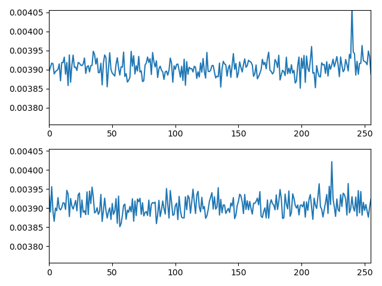

# 7.56 - RC4 Single-Byte Biases

**Links:** [challenge](https://cryptopals.com/sets/7/challenges/56), [attacks page](http://www.isg.rhul.ac.uk/tls/), [paper](http://www.isg.rhul.ac.uk/tls/RC4biases.pdf), [biases](http://www.isg.rhul.ac.uk/tls/biases.pdf)

We implement this one in C++ for performance.

We attack bytes 16 and 32 using 2²³ iterations (which is good enough as checked below).

### Biases check on bytes 16 and 32

```
$ g++ -Ofast -DBIASES 7.56.cpp -o biases
$ ./biases | ./plot.py
```



### Attack a random pair of bytes

```
$ g++ -Ofast 7.56.cpp -o attack
$ time ./attack
###########BE_SURE_TO_DRINK_YOUR_OVALTINE
               |               |
               U               R
./attack  14,04s user 0,00s system 99% cpu 14,067 total
```
```
$ time ./attack 
###BE_SURE_TO_DRINK_YOUR_OVALTINE
               |               |
               R               N
./attack  13,76s user 0,00s system 99% cpu 13,766 total
```
```
$ time ./attack                 
####BE_SURE_TO_DRINK_YOUR_OVALTINE
               |               |
               D               I
./attack  13,55s user 0,00s system 99% cpu 13,560 total
```
